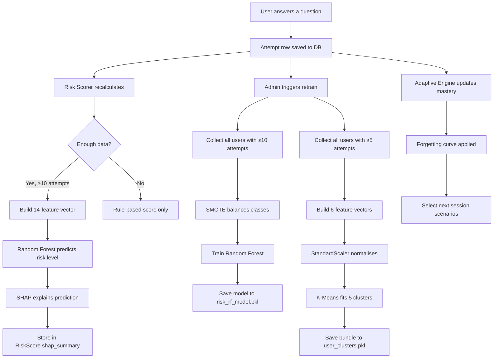

# Chapter 01 - Project Overview & ML Architecture

## What Is AHRID?

**AHRID** (Adaptive Human Risk Intelligence Dashboard) is a **security awareness training platform** for non-technical SME (Small & Medium Enterprise) staff in Kathmandu Valley. It trains employees to recognise:

- Phishing emails
- SMS phishing (smishing)
- Voice phishing (vishing)
- Social engineering
- Password hygiene issues
- USB baiting attacks
- Physical security threats
- Data handling violations

What makes it "intelligent" is the **ML layer** - instead of static quizzes, AHRID:

1. **Predicts** each user's risk level using a Random Forest classifier
2. **Groups** users into behavioural archetypes using K-Means clustering
3. **Adapts** training difficulty and content based on mastery tracking
4. **Explains** its predictions using SHAP (so users know *why* they're rated risky)
5. **Ingests** real-world threat data from OSINT feeds to generate fresh scenarios

---

## The Two Types of ML in Your Project

### 1. Supervised Learning - Random Forest

**Goal:** Given a user's behavioural data, **predict** their risk level (low/medium/high/critical).

```
         Input (14 features)                    Output
    ┌─────────────────────────┐           ┌──────────────┐
    │ avg_response_time_ms    │           │              │
    │ phishing_accuracy       │           │   low (0)    │
    │ smishing_accuracy       │           │   medium (1) │
    │ social_eng_accuracy     │──────────►│   high (2)   │
    │ password_accuracy       │   Random  │   critical(3)│
    │ physical_accuracy       │   Forest  │              │
    │ overall_accuracy        │           └──────────────┘
    │ fast_attempt_rate       │
    │ overconfident_rate      │
    │ session_consistency     │
    │ job_role_encoded        │
    │ total_sessions          │
    │ days_since_last_session │
    │ attempts_count          │
    └─────────────────────────┘
```

**Why "supervised"?** Because we provide the model with **labelled examples** - we know each training user's risk level (computed from their accuracy), and the model learns the mapping from features → labels.

### 2. Unsupervised Learning - K-Means Clustering

**Goal:** Discover **natural groupings** of users based on their behaviour, without predefined labels.

```
         Input (6 features)                    Output
    ┌─────────────────────────┐        ┌──────────────────────────┐
    │ avg_response_time_ms    │        │ Cluster 0: Overconfident │
    │ overall_accuracy        │        │ Cluster 1: Cautious      │
    │ accuracy_variance       │───────►│ Cluster 2: Inconsistent  │
    │ fast_attempt_rate       │ KMeans │ Cluster 3: Resilient     │
    │ total_sessions          │        │ Cluster 4: Disengaged    │
    │ session_consistency     │        └──────────────────────────┘
    └─────────────────────────┘
```

**Why "unsupervised"?** We don't tell the model what the groups should be - it discovers them on its own. We then *interpret* each cluster and give it a human-readable archetype name.

---

## How They Work Together - The Full Pipeline

Here's the complete data flow, from a user answering a question to the ML making predictions:



---

## File Map - Where Each ML Piece Lives

```
backend/
├── app/
│   └── services/
│       ├── random_forest_model.py    ← RF inference + feature vector building
│       ├── kmeans_clustering.py      ← KMeans inference + training + archetypes
│       ├── shap_explainer.py         ← SHAP TreeExplainer wrapper
│       ├── risk_scorer.py            ← Rule-based composite risk scoring
│       ├── adaptive_engine.py        ← Mastery tracking + scenario selection
│       ├── behavioral_profiler.py    ← Mistake pattern clustering
│       ├── telemetry_service.py      ← Dwell time + engagement aggregation
│       └── scenario_classifier.py    ← URL → lure type + difficulty
│
├── ml_models/
│   ├── risk_rf_model.pkl             ← Trained Random Forest (joblib)
│   ├── rf_features.json              ← Feature name contract
│   ├── rf_label_encoder.pkl          ← Label encoding for risk levels
│   ├── rf_metrics.json               ← Training metrics (accuracy, F1, etc.)
│   ├── user_clusters.pkl             ← KMeans bundle (scaler + model)
│   ├── kmeans_features.json          ← KMeans feature contract
│   └── kmeans_metrics.json           ← Clustering metrics (silhouette, etc.)
│
├── train_models.py                   ← Full training pipeline script
├── seed_synthetic_ml_data.py         ← Synthetic data generator for ML
└── seed_scenarios.py                 ← Scenario catalogue seeder
```

---

## Key Libraries Used

| Library | Version | Purpose in AHRID |
|---------|---------|-----------------|
| `scikit-learn` | ≥1.5.2 | RandomForestClassifier, KMeans, StandardScaler, metrics |
| `numpy` | ≥2.1.0 | Numerical operations, feature vectors |
| `joblib` | ≥1.4.2 | Model serialisation (pickle alternative) |
| `imbalanced-learn` | (optional) | SMOTE oversampling for class imbalance |
| `shap` | (optional) | TreeExplainer for model interpretability |
| `scipy` | (optional) | Paired t-test for awareness uplift evaluation |
| `pandas` | ≥2.2.3 | Data manipulation (used in evaluation endpoints) |

> **Note:** SHAP and imbalanced-learn are imported lazily (inside functions, not at module top). This means the app can boot and run even if these packages aren't installed - it just skips those features gracefully.

---

## The Three "Intelligence" Layers

### Layer 1: Rule-Based Intelligence (No ML)
- Risk scoring: `risk = (1 - accuracy) × 100`
- Difficulty progression: promote at 80%, demote at 40%
- Scenario selection: weakest-first, role-targeted

### Layer 2: Statistical ML (Classical ML)
- Random Forest for risk prediction
- K-Means for behavioural clustering
- SMOTE for class balancing

### Layer 3: Explainable AI (XAI)
- SHAP values for per-user feature attribution
- Plain-language risk factor explanations
- Transparency policy for ethical governance

This layered design means **the system always works** - even if the ML models aren't trained yet (Layer 1 handles it), and when they are, users get both predictions AND explanations.

---

## 🔬 Exercise

1. Open `backend/ml_models/rf_metrics.json` and identify:
   - How many training samples were used?
   - What was the overall accuracy?
   - Which class had the fewest samples before SMOTE?
   - What was the cross-validation F1 score?

2. Open `backend/ml_models/kmeans_metrics.json` and identify:
   - How many clusters were formed?
   - What is the silhouette score? Is that good? (Hint: ranges from -1 to +1, higher is better)
   - Which cluster has the most users?

---

> **Next:** [Chapter 02 - The Data Foundation →](./02_DATA_FOUNDATION.md)
